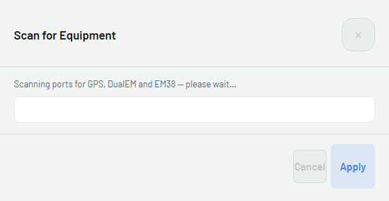
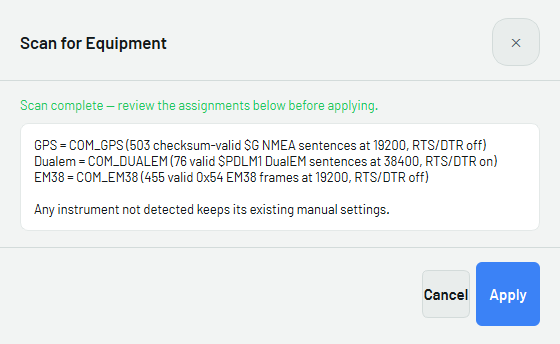
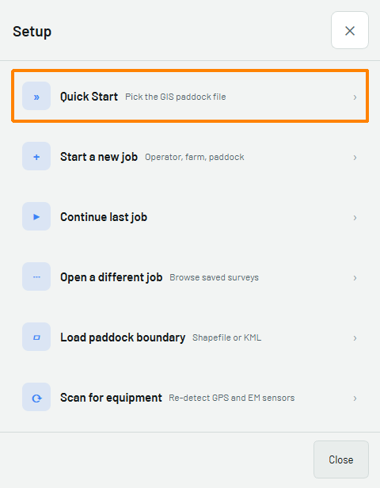
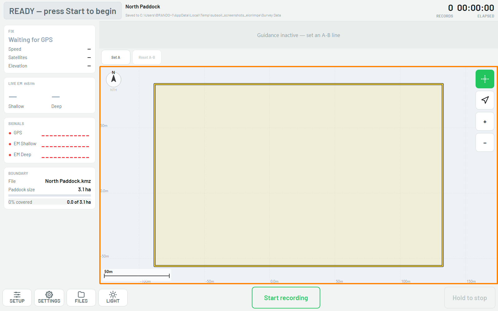
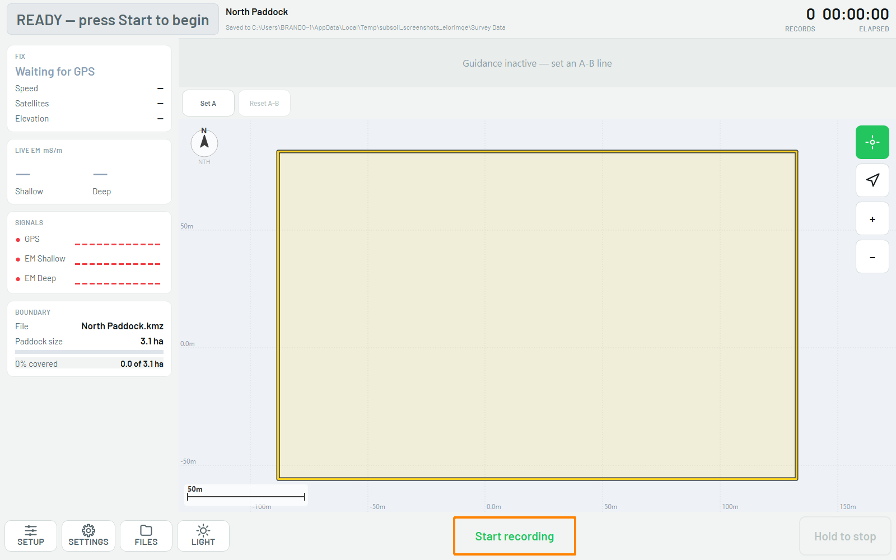
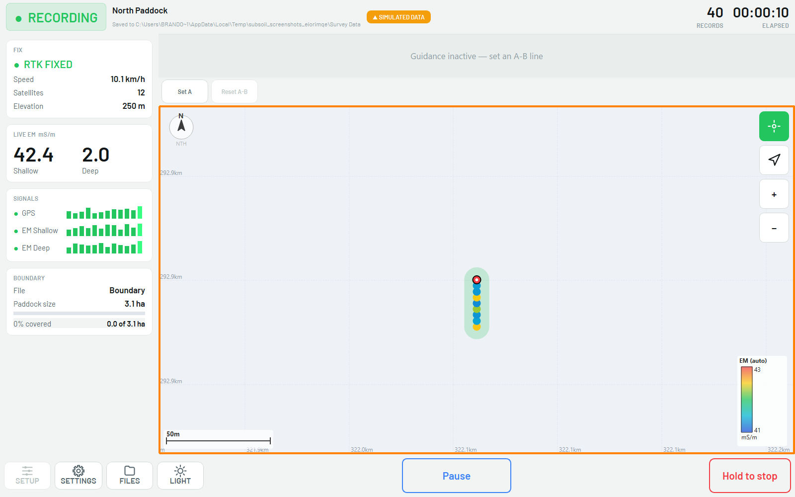
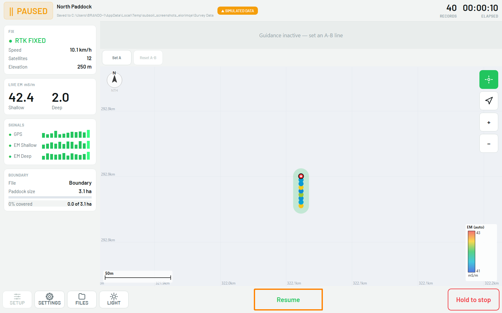
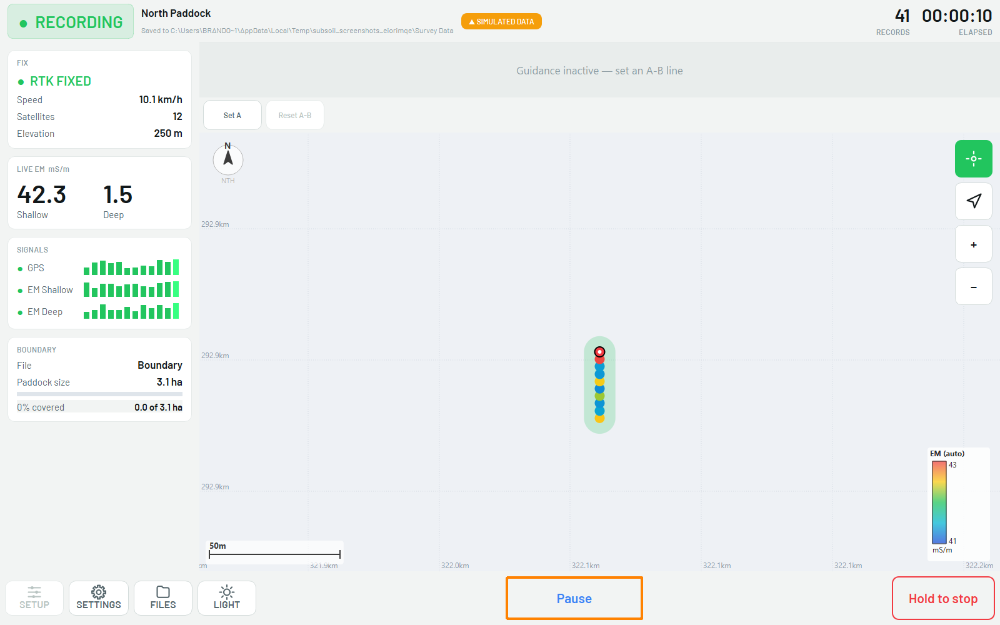
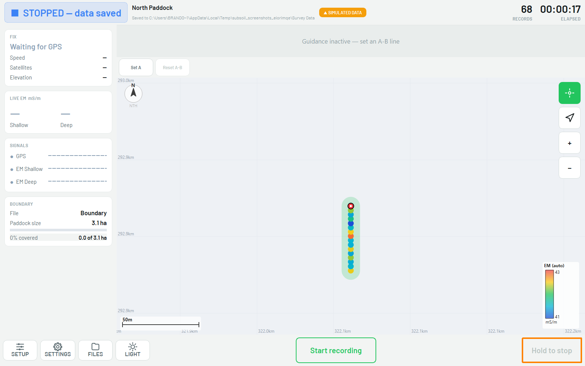

# :material-laptop: Survey Setup (Subsoil on the Getac)

The full click-by-click for setting up and running a DualEM survey in **Subsoil** on the
Getac. Exporting is covered in the next chapter, [Exporting](05-exporting.md).

!!! info "AT A GLANCE"
    Scan for equipment, load the paddock boundary with Quick Start, press **Start
    recording**, drive the paddock, then **Hold to stop** when done. Check the scan
    results before you trust them — a "not found" instrument keeps whatever it was
    last set to, silently.

## 1. Scan for equipment

Open Subsoil (double-click **run.bat**, or your desktop shortcut), then select
**Setup → Scan for equipment**.

*Scanning ports for GPS, DualEM and EM38 — please wait.*

The scan lists what it found on each port, with its evidence, so you don't have to take
its word for it.

*Scan complete — check the assignments, then **Apply**.*

!!! note "NOTE"
    An instrument the scan does **not** find keeps its existing manual settings. It is
    not cleared. If GPS or DualEM shows "not found", stop and check cabling and power
    before continuing — see [Troubleshooting](06-troubleshooting.md).

## 2. Load the paddock boundary

Open **Setup**, then select **Quick Start**.

*Setup → **Quick Start** → pick the GIS paddock file.*

Pick the paddock's `.shp`, `.kml` or `.kmz` file. The job name, save folder and boundary
are all set from this one file.

*The boundary loads onto the map with its area shown in the left-hand panel.*

## 3. Check before you drive

Before pressing Start, confirm the job name in the header matches the paddock you're in,
and that **FIX** in the left-hand panel is not stuck on *Waiting for GPS*.

*Job loaded, boundary in view. Confirm the details, then **Start recording**.*

## 4. Run the survey

Press **Start recording**. The header switches to **RECORDING**, and the left-hand panel
starts showing live EM and GPS values.

*Recording. **RECORDS** and **ELAPSED** in the top-right confirm data is landing.*

!!! warning "WARNING: SIMULATED DATA"
    If the orange **SIMULATED DATA** pill is showing, the file being written is marked
    as simulated, not real survey data. Confirm your instruments are actually connected
    before you drive.

### Pause and resume

Press **Pause** to hold the survey without ending the job — for a gate, a break, or to
reposition.

*Paused. No data is logged while paused.*

Press **Resume** to continue recording into the same file.

*Resumed — recording continues into the same CSV.*

## 5. End the job

When the paddock is finished, **hold** the **Hold to stop** button until it fills. This
is deliberate — a mistap here costs a re-drive, so a quick tap does nothing.

*Stopped — data saved. The record count and save path are shown top-left.*

---

Next: [Exporting](05-exporting.md). Get the data off the Getac and to the GIS team.
