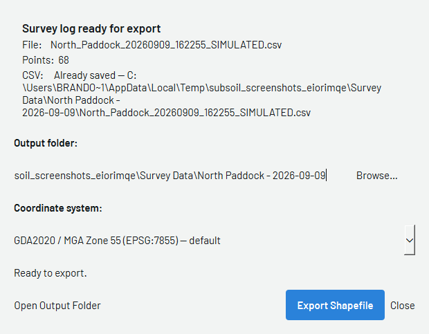

# :material-database-export: Exporting

Get the completed survey off the Getac and confirm it has reached the GIS team. This
follows on from [Survey Setup](04-survey-setup.md).

!!! info "AT A GLANCE"
    Open **Files → Export**, confirm the point count and CSV path, choose the
    coordinate system, then **Export Shapefile**. The job folder is synced by OneDrive —
    there is no manual upload step, but confirm it's actually syncing before you leave.

## 1. Export the shapefile

Once the survey is stopped, open **Files → Export**.

*Confirm the point count and CSV path, choose the coordinate system
(defaults to **GDA2020 / MGA Zone 55**), then **Export Shapefile**.*

`[CONFIRM: screenshot of the export-complete state — "Export Shapefile" clicked and
the confirmation/progress shown.]`

## 2. Confirm it reached the GIS team

The CSV and shapefile both save into the job's folder under **Survey Data**, which
OneDrive syncs automatically — there is no separate "send" step like T3RRA's SharePoint
upload.

`[CONFIRM: exact OneDrive folder path field techs should check, and how to tell from the
Getac that a sync has actually completed (icon state, "up to date" message, etc).]`

!!! warning "WARNING"
    Do not leave the field assuming the sync worked if you haven't checked. If the job
    folder shows a sync-pending icon rather than "up to date", see
    [Troubleshooting](06-troubleshooting.md) before you pack up.
