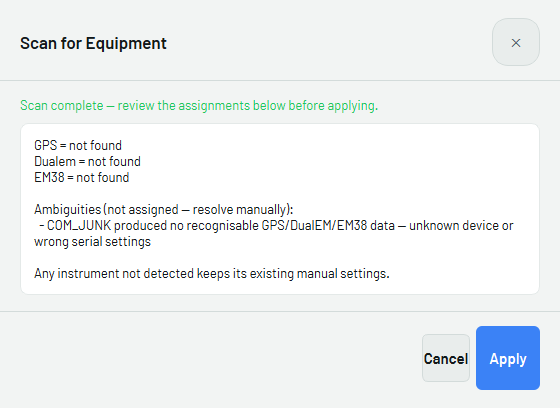
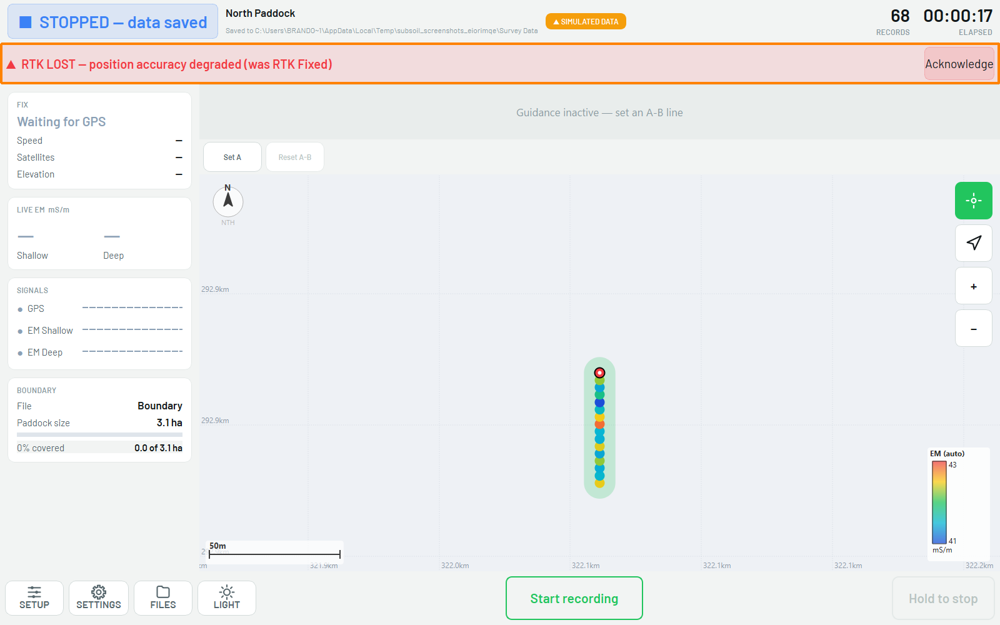

# :material-wrench: Troubleshooting

Quick fixes for the faults that stop a survey. This table is seeded from the
verification cues in the guide. It will grow as we hit and solve more faults in the
field.

!!! info "AT A GLANCE"
    Most field faults are a **COM port**, a **cable**, or a **power** problem. Work
    those three first.

## Symptom → likely cause → fix

| Symptom | Likely cause | Fix |
| --- | --- | --- |
| Scan for equipment says GPS/DualEM **not found** | Not powered, cable not seated, or wrong COM port | Check power and cabling, then re-run **Scan for equipment**. An instrument that isn't found keeps its old settings — it is not cleared. |
| **RTK LOST** banner shows during a run | GPS dropped from RTK Fixed to a lower-quality fix | Stop driving that line. Check the base station and correction link, and wait for **RTK FIXED** before continuing — see the warning below. |
| **Waiting for GPS** never clears | GPS not connected, or wrong port assigned | Re-run **Scan for equipment**; check the Emlid receiver has power and the cable is seated. |
| Wired DualEM won't connect | Unknown COM port | Open **Device Manager**, find the DualEM's COM port, set it manually, then re-scan. |
| Boundary won't load via Quick Start | Wrong file type, or a corrupt/empty boundary | Confirm the file is `.shp`, `.kml` or `.kmz` and actually contains a boundary; try **Setup → Load paddock boundary** directly instead. |
| Job folder shows sync-pending, not "up to date" | OneDrive hasn't finished syncing | Check the Getac has a working connection; wait, then confirm before packing up. See [Exporting](05-exporting.md). |
| `[CONFIRM: other common field faults Brandon/techs have hit]` | | |

*A scan that finds nothing still says "scan complete" — read the assignment list,
not just whether it finished.*

*RTK LOST — position accuracy degraded. The banner stays up until acknowledged.*

!!! danger "SWMS"
    Do not continue surveying on a degraded fix believing it is fine — a fix drop looks
    exactly like normal operation, and the loss is only obvious at the GIS desk once
    it's too late to re-drive on site. Stop, confirm the base station and correction
    link, and wait for **RTK FIXED** to show again before continuing.

## Escalation

If you have worked the COM port, cable, and power checks and it still will not work,
contact **Brandon on 0472 810 174** (see [Support](07-support.md)).
`[CONFIRM: after-hours and hardware-vs-software escalation path.]`
