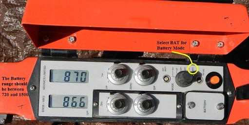
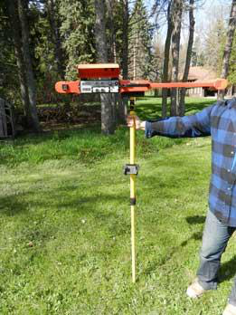
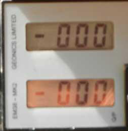
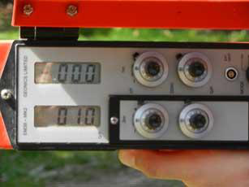
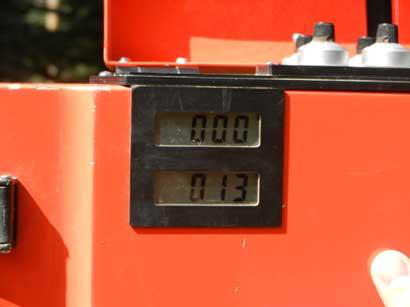
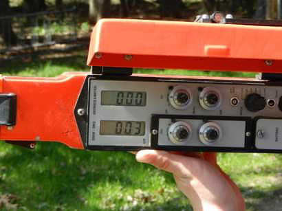
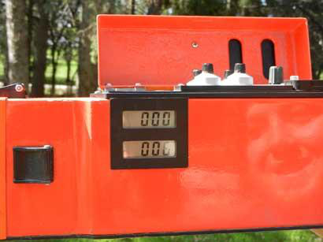

# :material-tune: Calibration

Calibrating (nulling) the EM38 before you survey. Unlike the DualEM, the EM38 needs a
manual calibration pass — do this every day, every time you move to a different
location, and every four hours of continuous operation.

!!! info "AT A GLANCE"
    Null the EM38 on the calibration block at the start of the day, at every new
    location, and at least every four hours. A wrongly-nulled EM38 gives readings that
    look plausible but are wrong — there's no error message to catch it.

## Required equipment

- [ ] EM38 soil sensor
- [ ] Calibration block (manufacturer-supplied)
- [ ] Power supply (9V battery)
- [ ] Clean cloth

## Safety and preparation

1. Work somewhere dry and clear of unnecessary items.
2. Inspect the EM38 for visible damage or dirt. Clean with a soft, dry cloth if needed.

## Step 1: Power on the sensor

Switch on the EM38 and turn the mode dial to **Battery Mode**. The battery should read
between **720 and 1500**. If it doesn't, replace the 9V battery.

*Select **BAT** for Battery Mode. The reading should be between 720 and 1500 — this
unit reads 870 / 866, both in range.*

!!! warning "WARNING"
    Remove the battery after each use and reinstall it before your next use — leaving
    it in flattens it between jobs.

## Step 2: Initial inphase nulling

Do this at the start of the day, at the first survey station, and again every time you
move to a new location or every four hours of continuous operation.

Remove all metal objects from your fingers, pockets, wrists and neck. Place the EM38 at
least **20 metres** away from any metal or object that could interfere with the sensor,
and let it warm up for a minimum of **10–15 minutes**.

## Step 3: Place the EM38 on the calibration block

Position the EM38 flat on the calibration block, stable and fully in contact with the
surface, at approximately **1.5 metres** off the ground, in the **horizontal dipole**
mode of operation.

*Hold the EM38 at approximately 1.5 m, in horizontal dipole mode.*

## Step 4: Run the calibration

Un-flip the locking nuts for both the **1 m** and **.5 m** I/P and Q/P dial knobs.

1. Set the instrument mode to **"1 m"**.
2. Adjust the **I/P** meter to zero using the 1 m control. The EM38 is sufficiently
   nulled if the I/P meter reads zero (±10 mS/m) at a height of 1.5 m.

    
    *Both meters at 000 — nulled.*

3. Adjust the **Q/P** meter to approximately 10 mS/m using the Q/P Zero Control. Note
   the mS/m reading.

    
    *Q/P set to 010 — note this value before rotating.*

4. Without changing height, rotate the EM38 into the **vertical dipole** mode and read
   the mS/m meter again. If zero is set correctly, this reading should be **twice** the
   horizontal reading.

    
    *Vertical reading — compare against the horizontal reading from step 3.*

!!! note "NOTE — if the zero isn't right"
    Take the horizontal and vertical readings again and write both down. Subtract:
    **vertical − horizontal = the adjustment value.**

    Example: vertical 13, horizontal 10 → 13 − 10 = 3. In horizontal dipole mode,
    adjust the H dipole control to **3**.

    
    *H dipole set to the calculated adjustment value.*

    Rotate back into vertical dipole mode — it should now read **double** the
    adjustment value (3 × 2 = 6).

    
    *Vertical reading confirms the 2× relationship after adjustment.*

    Once set, lock in the locking nuts.

5. Set the instrument to **.5** and repeat the same process using the .5 I/P and Q/P
   dials.

### Worked examples

| Vertical reading | Horizontal reading | Adjustment (V − H) | Expected vertical after adjustment |
| --- | --- | --- | --- |
| 35 mS/m | 12 mS/m | 23 | 46 |
| 16 mS/m | 14 mS/m | 2 | 4 |

## Step 5: Complete calibration

Once calibration is successful, remove the EM38 from the calibration block, power down
the unit, then set it up in the carrier with the connect data cable and turn it back on
ready for operation.

!!! danger "SWMS"
    Nulling is done in the open, away from metal and vehicles. Keep clear of moving
    traffic and machinery while positioning the EM38 and calibration block.

## Towing setup

!!! warning "WARNING — null the whole rig, not just the sensor"
    The instrument must be properly nulled **in situ with the entire towing setup**
    (sled, hitch, etc.) attached, before surveying begins. This accounts for any
    permanent influence from the adjacent metal components — nulling the EM38 on its
    own and then bolting it into the carrier invalidates the calibration.

## Troubleshooting tips

- If readings fluctuate, make sure the sensor is clean and the calibration block is
  free of debris.
- Always use the manufacturer's calibration block — not a substitute.
- If calibration keeps failing, stop and contact support (see [Support](08-support.md))
  rather than surveying on an unreliable null.
