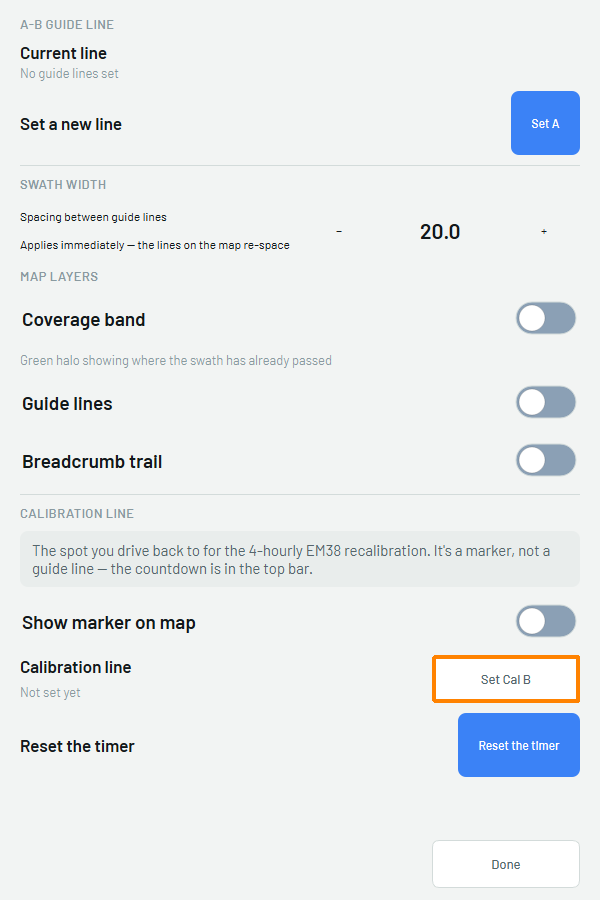
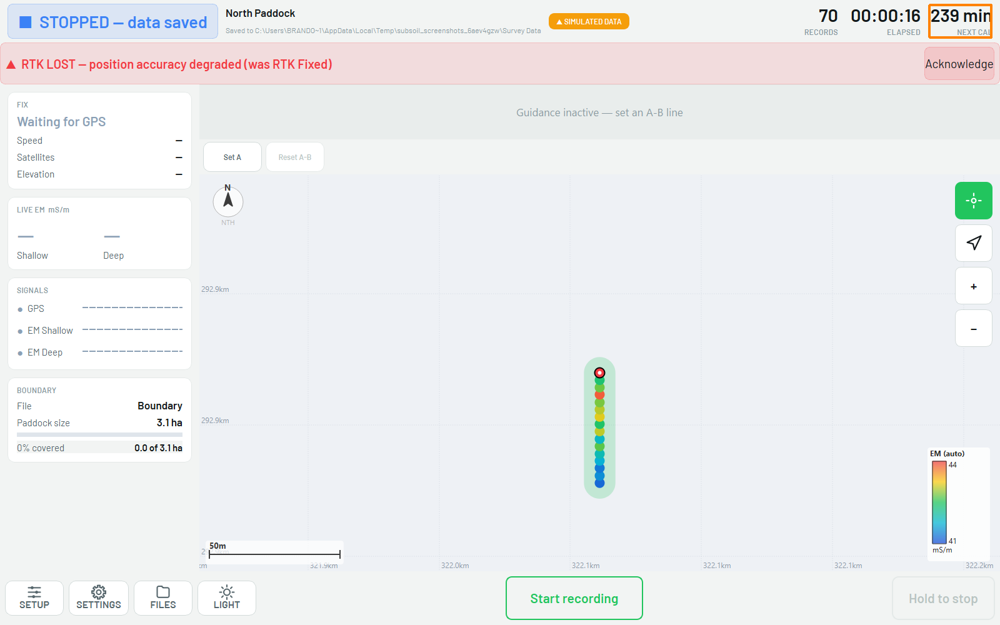

# :material-laptop: Survey Setup (Subsoil on the Getac)

The full click-by-click for setting up and running an EM38 survey in **Subsoil** on the
Getac, once the EM38 is calibrated (see [Calibration](04-calibration.md)). Exporting is
covered in the next chapter, [Exporting](06-exporting.md).

!!! info "AT A GLANCE"
    Scan for equipment, load the job with **Quick Start** from the paddock's SharePoint
    folder, confirm GPS and EM38 are live, set the **calibration line**, then set the
    **A-B guide line** and drive. **NEXT CAL** counts down from four hours the moment the
    calibration line is set — do not let it reach zero mid-paddock.

## Before you start

- [ ] EM38 calibrated for today / this location (see [Calibration](04-calibration.md))
- [ ] GPS connected and reading
- [ ] Getac has the paddock's job folder available in SharePoint (synced via OneDrive)

## 1. Scan for equipment

Open Subsoil, then select **Setup → Scan for equipment**.

`[CONFIRM: screenshot — Scan for Equipment dialog scanning ports for GPS and EM38.]`

The scan lists what it found on each port, with its evidence, so you don't have to take
its word for it.

`[CONFIRM: screenshot — Scan for Equipment dialog showing GPS and EM38 found with evidence, Apply highlighted.]`

!!! note "NOTE"
    An instrument the scan does **not** find keeps its existing manual settings. It is
    not cleared. If GPS or EM38 shows "not found", stop and check cabling and power
    before continuing — see [Troubleshooting](07-troubleshooting.md).

## 2. Quick Start — load the job from SharePoint

Open **Setup**, then select **Quick Start**.

`[CONFIRM: screenshot — Setup sheet with the Quick Start row highlighted.]`

Pick the job file from the paddock's folder in your synced **Precision Agriculture**
SharePoint library:

```
...\Precision Agriculture\PA Survey - General - (Deal ID)\
```

Quick Start does three things from that one file: it names the job, loads the paddock
**boundary** onto the map, and sets that same SharePoint folder as the **save point** for
everything this job writes from here on.

`[CONFIRM: screenshot — map showing the loaded paddock boundary before the survey starts.]`

!!! note "NOTE — where the CSV goes"
    The survey CSV writes into a **Survey Data** subfolder inside that job folder on
    SharePoint. Nothing needs to be moved by hand.

## 3. Confirm before you drive

Press **Start**. The header switches to running, and the left-hand panel starts showing
live GPS and EM38 values. Before you drive, confirm everything reads green — GPS fix and
EM38 both live, not "waiting" or flagged.

`[CONFIRM: screenshot — shell running, GPS and EM38 both confirmed live/green.]`

!!! warning "WARNING: SIMULATED DATA"
    If the orange **SIMULATED DATA** pill is showing, the file being written is marked
    as simulated, not real survey data. Confirm your instruments are actually connected
    before you drive.

## 4. Set the calibration line

Open the map toolbar. The EM38 gets an extra **Set Cal A / Set Cal B** control that a
DualEM survey never shows — DualEM self-calibrates, EM38 doesn't.


*Calibration line is a stretch of ground you drive back to every four hours, not a
point — the countdown lives in the top bar, not here.*

Press **Set Cal A** at one end of a known stretch of ground.


*Point A is set. Drive to the other end, then press **Set Cal B**.*

Press **Set Cal B** at the other end. The line is now complete and saved to the job
folder — pressing the button again starts a **New Cal Line** instead.


*Line complete. Come back to drive this same stretch at every recalibration.*

!!! note "NOTE"
    Setting a complete line is what saves it. Nothing else needs to be pressed. If you
    replace an existing line, Subsoil asks you to hold to confirm first — the old line
    is what the job has been calibrated against since day one. **Reset Cal** clears the
    calibration marker only — it does not touch your survey guide line.

The moment the calibration line is complete, the header shows a **NEXT CAL** countdown.


*NEXT CAL counts down from four hours. It reads "—" if no line has been set yet.*

## 5. Set the A-B guide line and drive

Still on the map toolbar, press **Set A** at your first pass, drive to the far end, then
press **Set B**. Subsoil generates the guide lines and the lightbar starts steering.

`[CONFIRM: screenshot — map toolbar with Set A / Set B highlighted, guide lines drawn.]`

Follow the lightbar up and down the paddock. **Reset A-B** clears the guide line, but it
only works in the **lone-A state** — after Set A, before Set B — not once a full line is
drawn. To lay a different line once both ends are set, use **New A-B** instead.

!!! danger "SWMS"
    A wrongly-nulled or overdue EM38 gives readings that look completely plausible but
    are wrong — there is no error message to catch it. Do not let **NEXT CAL** reach
    zero mid-paddock. Drive back to the calibration line, re-null the EM38 (see
    [Calibration](04-calibration.md)), then set a fresh cal line before continuing.

## 6. Pause and resume between paddocks

Press **Pause** when you're moving between paddocks, through a gate, or taking a break —
no data is logged while paused, but GPS keeps running so you can still see your position
on the map.

`[CONFIRM: screenshot — shell in PAUSED state, Resume highlighted.]`

Press **Resume** before you start driving survey lines again. Data keeps writing into the
same CSV — don't forget this step, or the next stretch of driving goes unrecorded.

## 7. Recalibrate every four hours

When **NEXT CAL** counts down to zero (or you move to a new location — see
[Calibration](04-calibration.md)), stop, drive back to the calibration line, re-null the
EM38 on the calibration block, then set a fresh **Set Cal A / Set Cal B** line before
continuing to survey.

## 8. End the job

When you're stopping for the day but coming back to the same paddock tomorrow, **hold**
the **Stop** button until it fills — this is deliberate, a mistap here costs a re-drive.
Stopping saves the data. Every A-B line, calibration line, and data point already
recorded is saved into the job folder, so when you reopen the job tomorrow with
**Continue Job** from the Setup menu, everything is exactly where you left it.

`[CONFIRM: screenshot — shell in STOPPED state, data saved, save path shown.]`

`[CONFIRM: is there a separate "finish the job" / "end job" action beyond Stop, or is
Stop + confirming the SharePoint export (see Exporting) the whole story? Confirm with
Brandon — the field UI's control set only documents one Stop button.]`

---

Next: [Exporting](06-exporting.md). Get the data off the Getac and to the GIS team.
