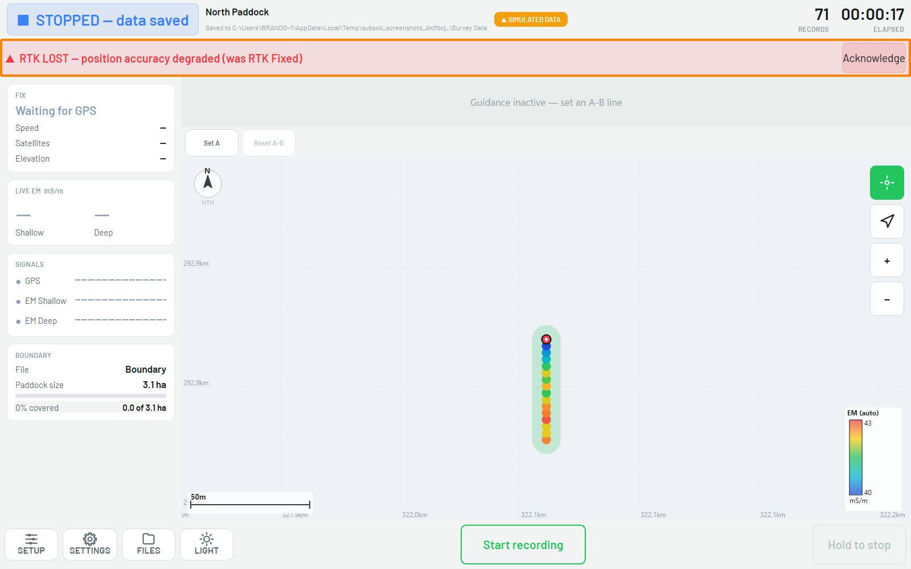

# :material-wrench: Troubleshooting

Quick fixes for the faults that stop an EM38 survey.

!!! info "AT A GLANCE"
    Most field faults are a **battery**, a **null**, a **cable**, or a **power** problem.
    Work those four first.

## Symptom → likely cause → fix

| Symptom | Likely cause | Fix |
| --- | --- | --- |
| Battery reads outside 720–1500 in Battery Mode | Flat or failing 9V battery | Replace the 9V battery, then re-check the reading. |
| Readings fluctuate or look inconsistent | Dirty sensor or debris on the calibration block | Clean the EM38 and calibration block with a dry cloth, then re-null. |
| Vertical reading isn't ~2× the horizontal reading after nulling | Zero not set correctly | Take fresh horizontal/vertical readings, calculate vertical − horizontal, and re-adjust the H dipole control (see [Calibration](04-calibration.md)). |
| Calibration keeps failing after repeated attempts | Sensor fault, or towing setup not nulled in situ | Stop surveying. Contact support, do not survey on an unreliable null. |
| GPS not found on scan | Receiver not powered or not connected | Check the Emlid receiver has power and the cable is seated, then re-scan. |
| **NEXT CAL** reaches zero mid-paddock | Recal window elapsed without a fresh cal line | Stop, drive back to the calibration line (or set a new one), re-null the EM38, then continue, see [Survey Setup](05-survey-setup.md#4-set-the-calibration-line). |
| **RTK LOST** banner shows during a run | GPS dropped from RTK Fixed to a lower-quality fix | Stop driving that line. Check the base station and correction link, and wait for **RTK FIXED** before continuing. |
| `[CONFIRM: other common field faults Brandon/techs have hit with the EM38 or Subsoil]` | | |

*A scan that finds nothing still says "scan complete", read the assignment list, not
just whether it finished.*

*RTK LOST, position accuracy degraded. The banner stays up until acknowledged.*

!!! warning "WARNING"
    Always re-null after moving to a new location or every four hours of continuous
    operation. Surveying on a stale calibration produces data that looks fine but is
    wrong, there's no on-screen warning for it.

## Escalation

If you have worked the battery, null, cable, and power checks and it still will not
work, contact **Brandon on 0472 810 174** (see [Support](08-support.md)).
`[CONFIRM: after-hours and hardware-vs-software escalation path.]`
