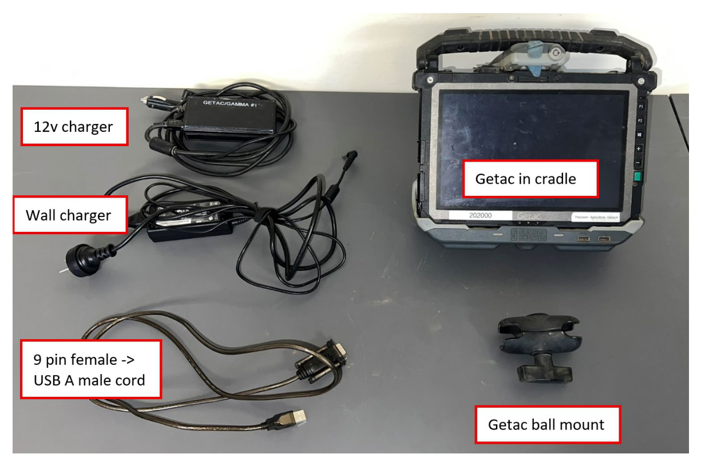
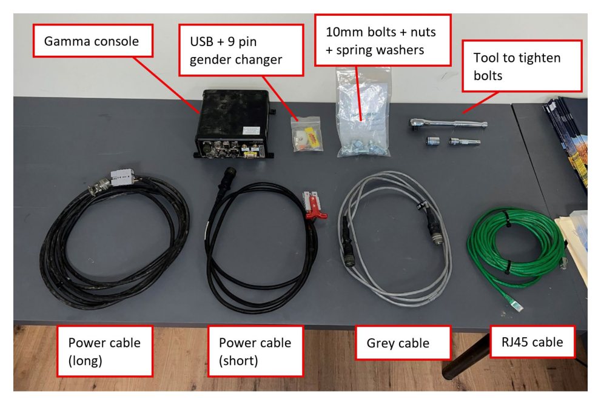
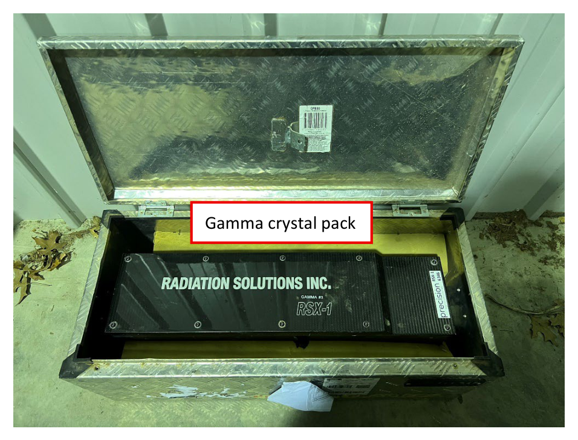
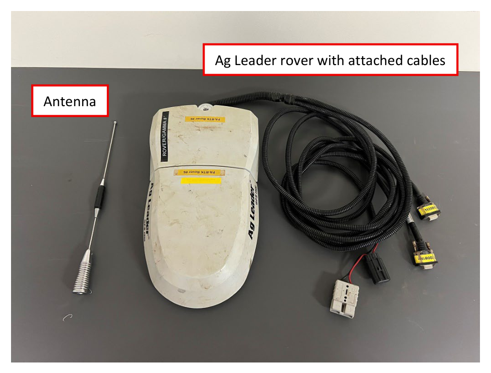

# :material-package-variant-closed: Equipment Required

Before heading out, make sure you have the following kit. Everything is organised by
box — pack against each list and check nothing has been left behind.

!!! info "AT A GLANCE"
    Five boxes: Getac, Gamma console unit, Gamma crystal pack (its own case), and the
    Rover case. The crystal pack travels separately from everything else.

## Getac box

- [ ] Getac computer
- [ ] Gamber-Johnson Getac cradle
- [ ] Getac ball mount
- [ ] Wall charger
- [ ] 12V car/Polaris charger
- [ ] 9-pin female → USB A male cord

*Getac box: 12V charger, wall charger, 9-pin-to-USB cord, Getac in its cradle, and the ball mount.*

## Gamma console unit box

- [ ] Gamma console
- [ ] Green RJ45 cable
- [ ] 9-pin gender changer
- [ ] Black power cable (Anderson → gamma console plug) — **short**
- [ ] Black power cable (Anderson → gamma console plug) — **long**
- [ ] Grey cable (gamma crystal pack → gamma console)
- [ ] USB thumbdrive, **plus a backup** in case of failure
- [ ] 10mm bolts, nuts and spring washers
- [ ] Tool to tighten bolts (adjustable wrench, socket spanner, etc.)

*Console, USB + 9-pin gender changer, 10mm hardware, tools, and the four cables: long and
short power, grey (crystal pack), and green (RJ45).*

## Gamma crystal pack travel case

- [ ] Gamma crystal pack — **kept in its own case, separate from everything else, to
      avoid damage**

*The crystal pack (Radiation Solutions RSX-1) in its dedicated travel case.*

## Rover case

- [ ] Ag Leader rover, with Anderson plug, 1Hz cable and 5Hz cable
- [ ] Antenna

*Rover with its cables attached, and the antenna.*

!!! danger "SWMS"
    Minimise shock to the gamma crystal pack at all times — it is extremely valuable and
    fragile. Never drive with it unmounted.
