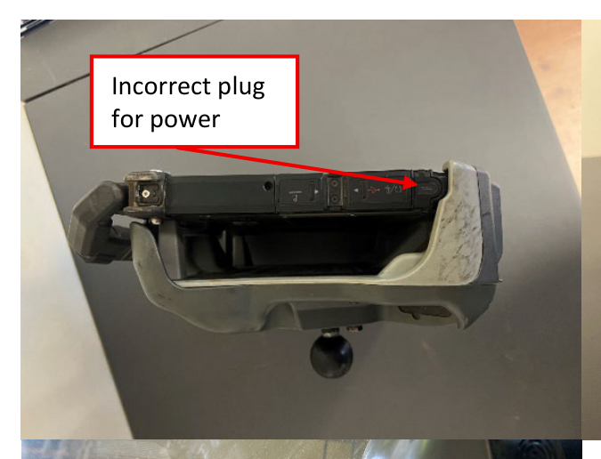
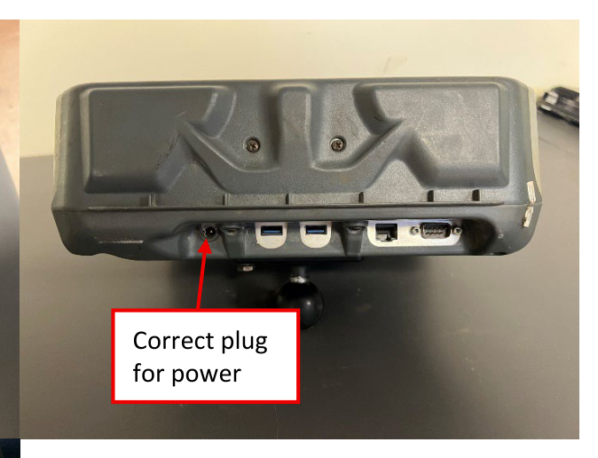
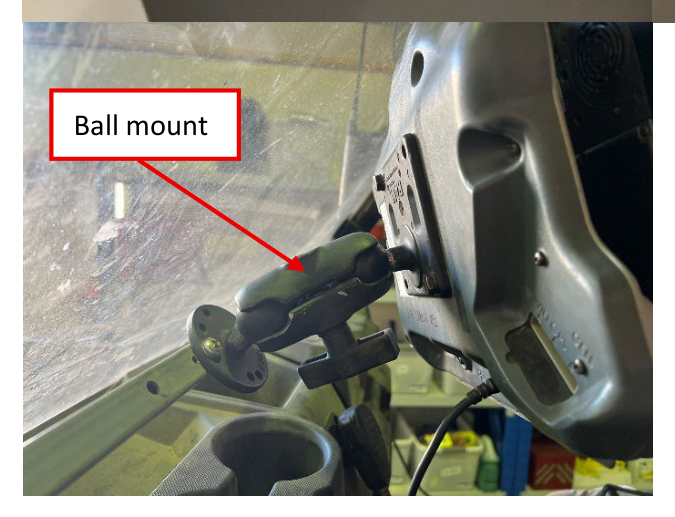
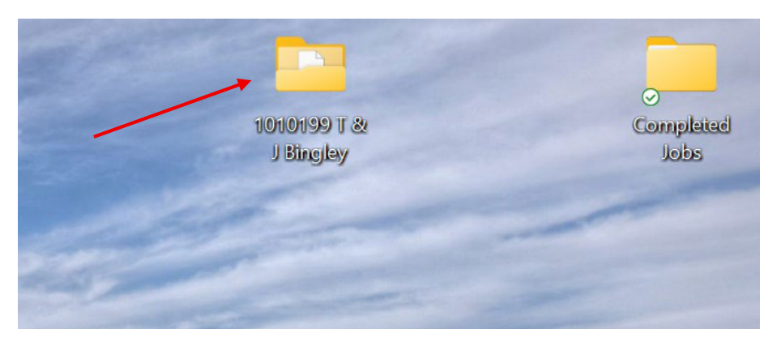

# :material-laptop: Getac Setup

Mount the Getac and set up today's job folder before you start rigging the gamma
equipment.

!!! info "AT A GLANCE"
    Plug power into the **cradle**, not the Getac directly — plugging into the Getac
    means later connections won't function. Keep each day's files in their own subfolder.

## 1. Mount and power the Getac

Lock the Getac into the cradle and mount it to the vehicle using the ball mount. Plug
the 12V power cable into the car/Polaris on one end and the **bottom of the Getac
cradle** on the other.

!!! warning "WARNING — wrong plug breaks later connections"
    Do not plug the power cable into the Getac directly. If you do, the cable
    connections you make later (GPS, gamma console) won't function.

-   
    **Incorrect** — do not plug in here.

-   
    **Correct** — plug into the bottom of the cradle.

*Getac mounted and ready.*

Turn on the Getac and log in.

## 2. Set up today's job folder

Create a folder on the desktop named with the **deal ID and grower name**, if not
already there. This is the working space for all files in this job.

Inside it, create a subfolder for **today's date and the survey data type** (Gamma or
EM38). Keep each day of surveying separate — mixing days' files together causes
confusion later.

*Example: `1010199 T & J Bingley`, with a `Completed Jobs` folder alongside it for
finished work.*

---

Next: [Gamma Rig Setup](03-gamma-setup.md). Mount the crystal pack, console, and rover.
