# :material-radioactive: Gamma Rig Setup

Mounting the crystal pack, console and rover, and getting live data flowing in
RadAssist. This follows on from [Getac Setup](02-getac-setup.md).

!!! info "AT A GLANCE"
    Bolt the crystal pack to the front of the vehicle with the power connection on the
    **passenger side**. Route ute cables through the passenger window so the door
    doesn't pinch them. Confirm three green boxes and live data in RadAssist before you
    start surveying.

## 1. Mount the crystal pack

Remove the gamma crystal pack from its travel case and bolt it to the front of the
ute/Polaris using the 10mm bolts, spring washers and nuts, bolts through underneath,
spring washers and nuts on top. Ensure the **power connection for the crystal pack
faces the passenger side** of the vehicle.

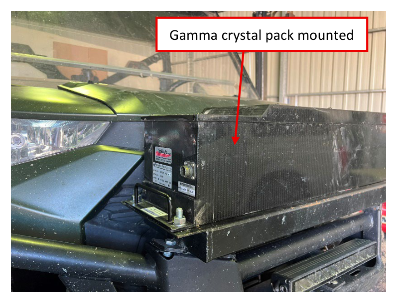
*Crystal pack mounted, power connection on the passenger side.*

## 2. Power the console

Place the gamma console on the passenger seat and connect it to the car/Polaris battery
using the black power cable.

!!! note "NOTE, ute routing"
    If using a ute, route the cable through the passenger window to avoid it being
    pinched by the door.

-   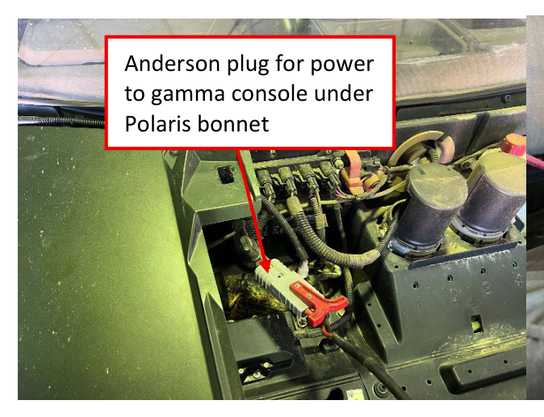
    Anderson plug for console power, under the Polaris bonnet.

-   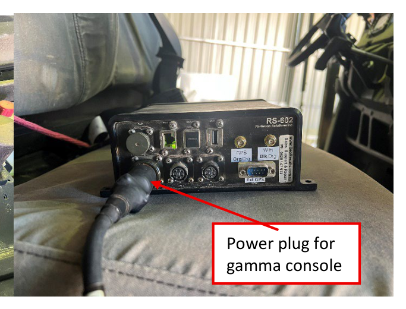
    Power plug on the gamma console.

## 3. Connect the console to the crystal pack

Connect the gamma console to the gamma crystal pack using the **grey cable**. Again,
route through the passenger window on a ute to avoid pinching.

-   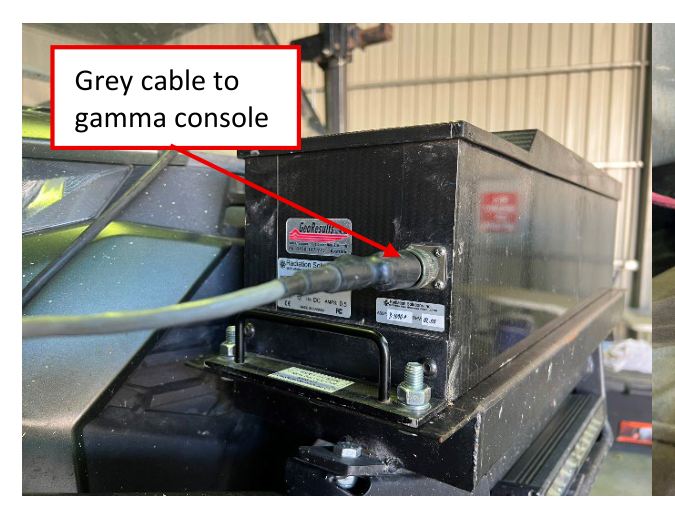
    Grey cable at the console end.

-   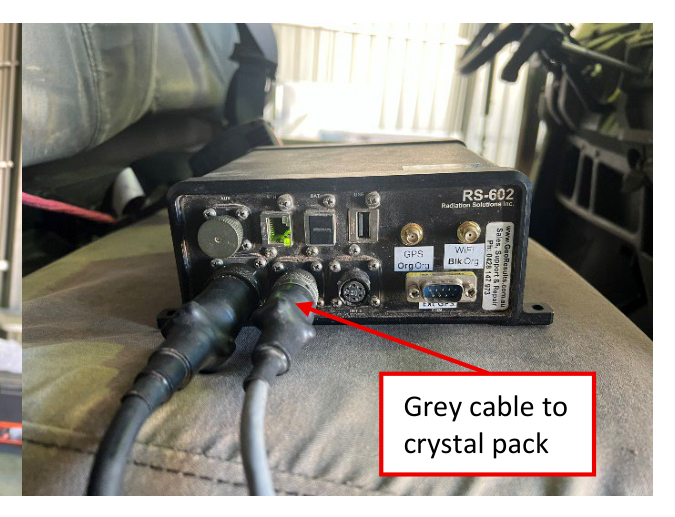
    Grey cable at the crystal pack end.

## 4. Connect the Getac

Plug the **green ethernet cable** into the bottom of the Getac cradle on one end and the
gamma console on the other.

-   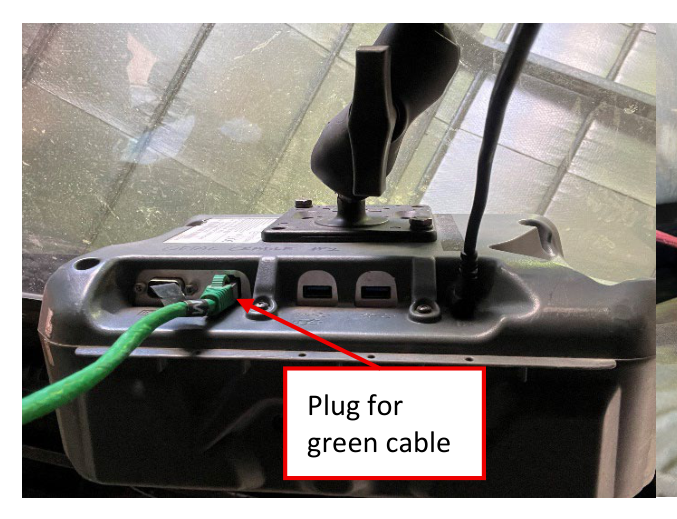
    Green cable into the Getac cradle.

-   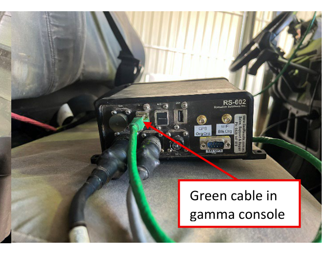
    Green cable into the gamma console.

## 5. Mount the rover

Connect the antenna to the Ag Leader rover. Place the rover on the roof of the vehicle
(the metal plate, for the Polaris) and connect it to power using the Anderson plug in
the back tray.

-   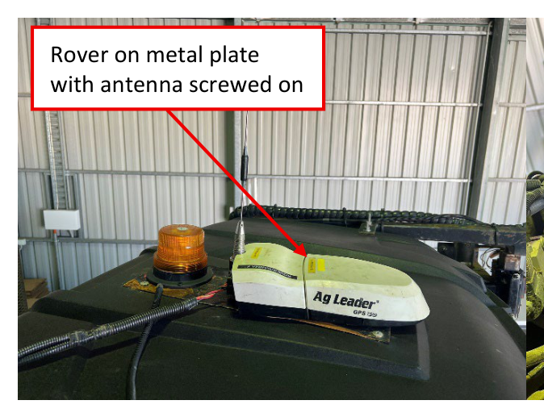
    Rover mounted with antenna screwed on.

-   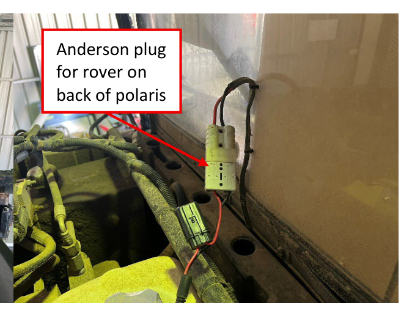
    Rover power, Anderson plug at the back.

## 6. Route and connect the rover cables

Route the other two 9-pin cables from the rover through the passenger side window.
Connect the **GAMMA connection (1Hz)** to the gamma console (using the gender changer on
the console) and the **GETAC connection (5Hz)** to the bottom port on the Getac.

!!! warning "WARNING"
    Route these cables so they cannot get pinched or broken, use tape to secure them if
    necessary, and tighten the screws lightly to keep the cord in place.

-   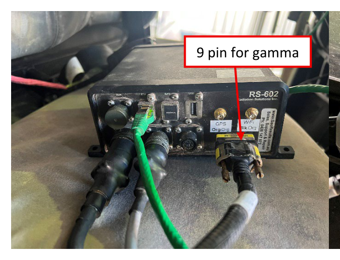
    9-pin (GAMMA / 1Hz) into the console.

-   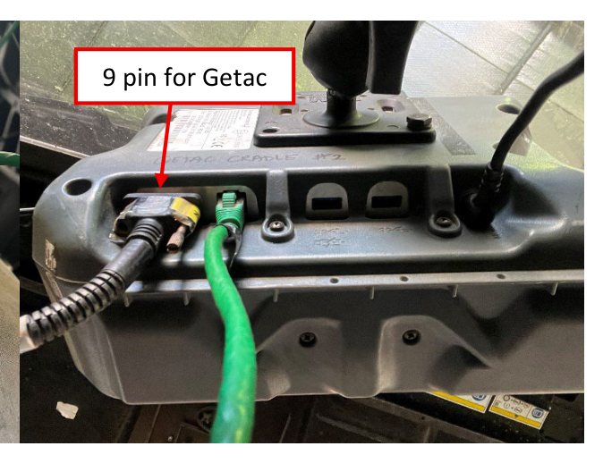
    9-pin (GETAC / 5Hz) into the Getac.

## 7. Connect in RadAssist

Turn the vehicle's ignition on. On the Getac, open **RadAssist** (on the desktop), then:

1. Click **File** → **Connect to Device**.
2. Select the **RS-602AG**.
3. Click **Connect**.
4. Click **Start Recording**.

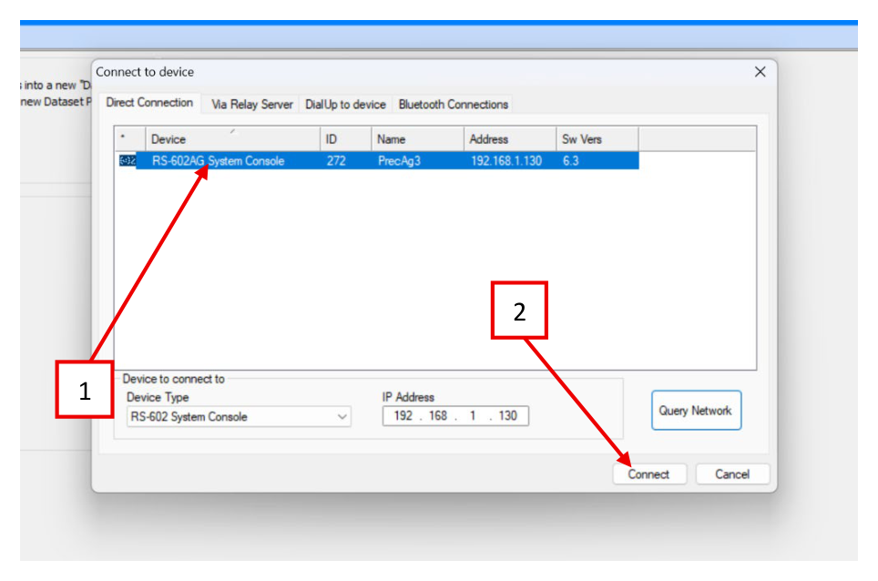
*Select the RS-602AG System Console, then Connect.*

## 8. Verify the connection

If everything is set up correctly, RadAssist shows:

- [ ] Three green boxes lit at the top of the window
- [ ] Live data under the **Live Data View** tab at the bottom
- [ ] Data being recorded, shown under **Device connection** at the top

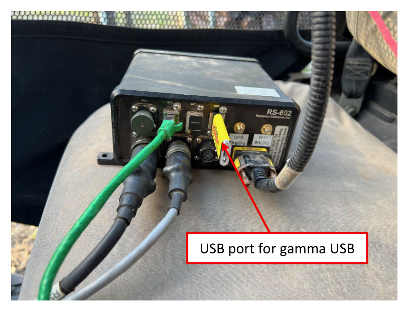
*Three green boxes, live data streaming, and recording confirmed.*

!!! note "NOTE"
    If these three conditions aren't met, the gamma unit may need a few minutes to
    configure. This can happen periodically, and especially after the unit has moved a
    long distance between jobs. Leave it and check back later, see
    [Troubleshooting](06-troubleshooting.md) if it doesn't resolve.

## 9. Start surveying

The gamma unit is now set up and surveying can start. Periodically check back in
RadAssist that the three conditions in step 8 are still met while you drive.

---

Next: [Data Collection & Export](04-data-collection.md). Back up and export at the end
of each paddock or day.
