# :material-database-export: Data Collection & Export

Back up the day's data off the gamma console, then load and export it in RadAssist. This
follows on from [Gamma Rig Setup](03-gamma-setup.md). Do this at the end of every
paddock or day.

!!! info "AT A GLANCE"
    USB backup off the console first, then load and export to shapefile in RadAssist,
    zip the export, and **email it** — gamma does not upload to SharePoint
    automatically the way DualEM/EM38 does.

## 1. Back up to USB

When the paddock or day is done, place the USB thumbdrive into the gamma console. Go
into the **Event Log** at the bottom of RadAssist and check it says **USB HDD
Detected** — it will then start saving the files.

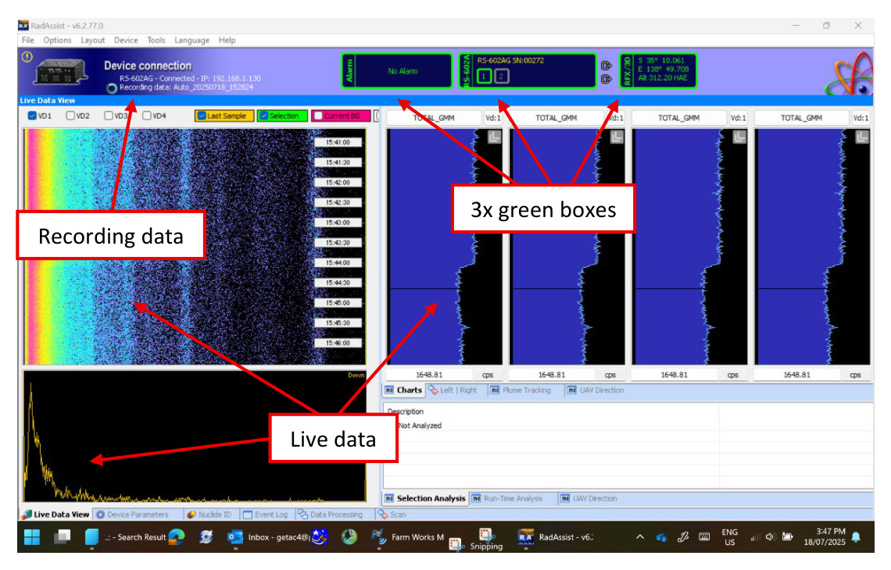
*USB port for the gamma USB, on the console.*

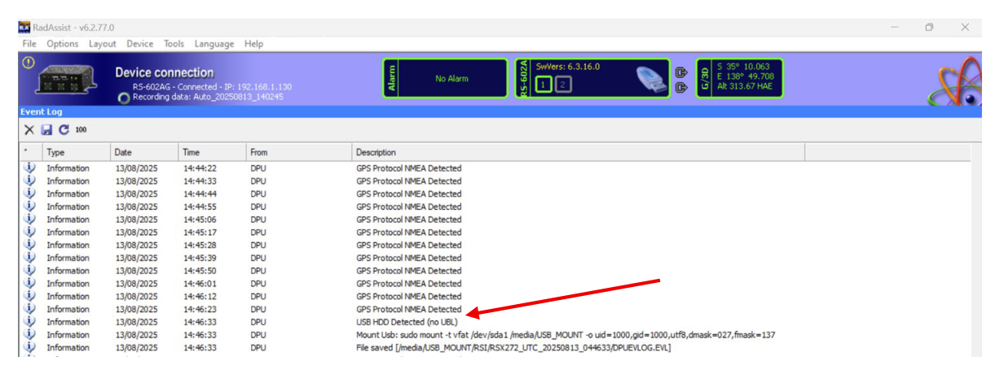
*USB HDD Detected (no UBL) — the backup has started.*

After waiting 2–3 minutes, the transfer should be complete. The Event Log will say **USB
HDD Backup Done** and **Unmount Usb** — you can now remove the thumbdrive.

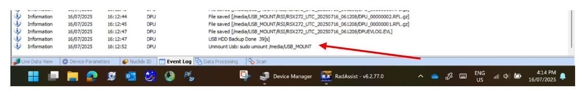
*Backup done and USB unmounted — safe to remove.*

## 2. Copy the file to today's job folder

Plug the USB thumbdrive into the Getac. Open its files and check the **RSI** folder for
a file named `RSX…_UTC_<date and time in UTC>` — you can also check this under **Date
Modified**.

!!! example
    `RSX272_UTC_20250813_044633` = file from 13 August 2025.

Copy this file into today's job folder on the desktop (see [Getac Setup](02-getac-setup.md)).

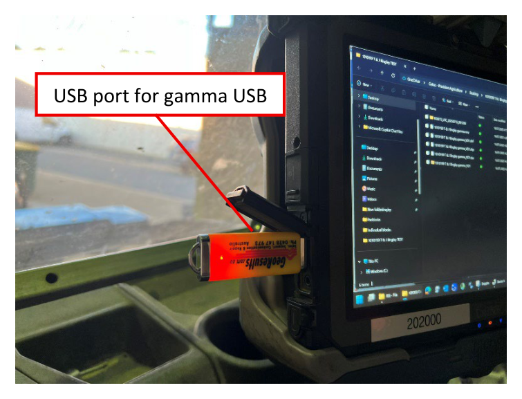
*Find today's RSX folder by its UTC timestamp.*

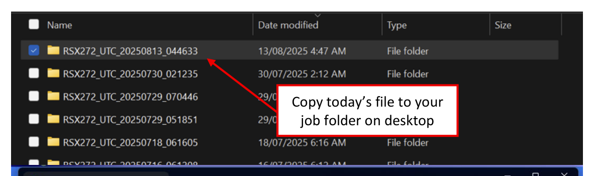
*Copy today's file to your job folder on desktop.*

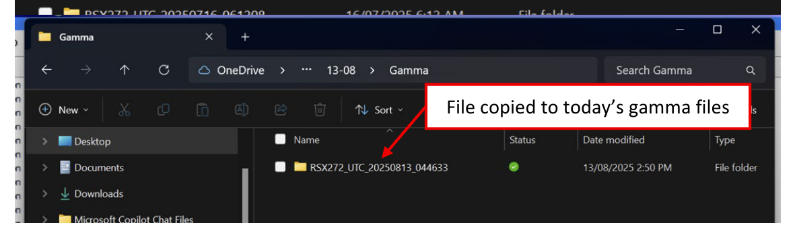
*File copied to today's gamma files.*

## 3. Load the data in RadAssist

Open RadAssist and click the **Data Processing** tab. Click **Load**, then **Load Raw
Files Directory**. Navigate to Desktop, find the folder for the current deal, select the
folder you copied from the USB, and press **OK**.

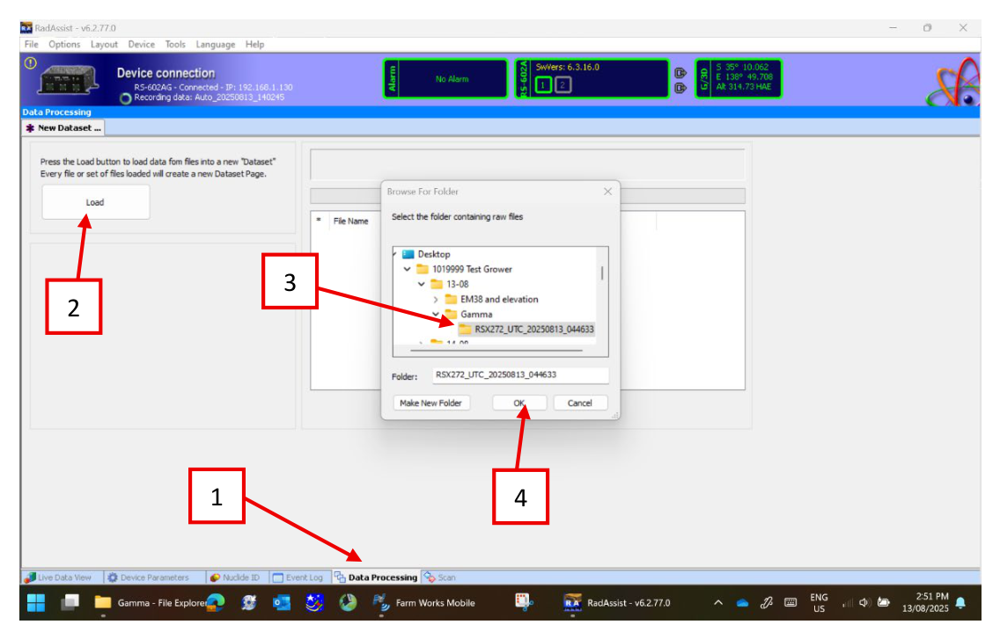
*Data Processing → Load → browse to the copied RSX folder → OK.*

Once loaded, check that **RS-602 System Console** is set as the device type, then click
**Show Loaded Data**.

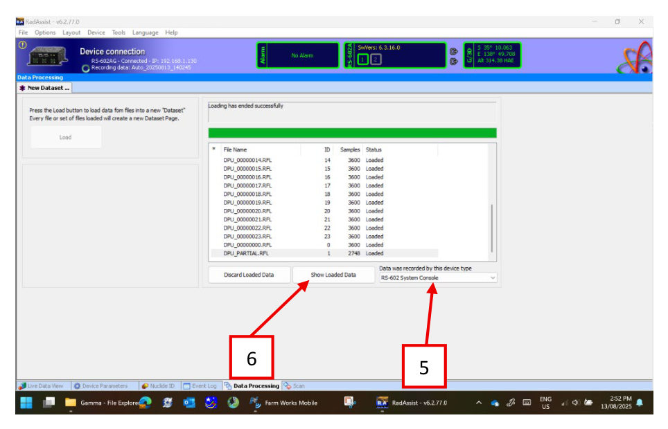
*Files loaded successfully — confirm device type, then Show Loaded Data.*

## 4. Export to shapefile

Click **Export** in the bottom left.

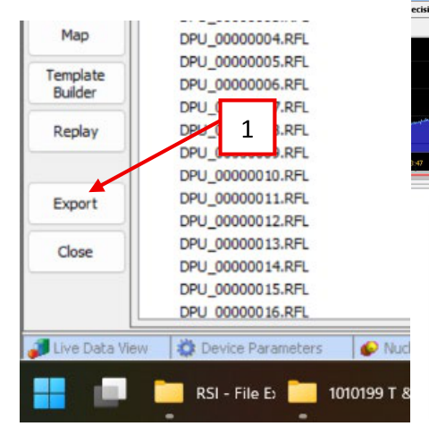
*Export, bottom left.*

Under **Data range**, select **All data**, then click **Next**.

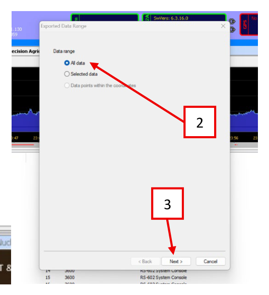
*All data → Next.*

Under **Output format**, select **ESRI Shape File (SHP)**. Under **File Name**, click
the **…** button and choose the folder on the desktop where today's working files are
saved. Name the file **date + deal ID + grower name + gamma export**.

!!! example
    `13-08 1019999 Test Grower gamma export`

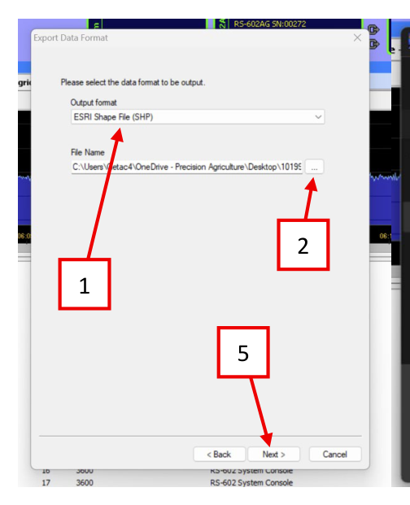
*Output format: ESRI Shape File (SHP).*

Press **Save**, then **Next** back in RadAssist.

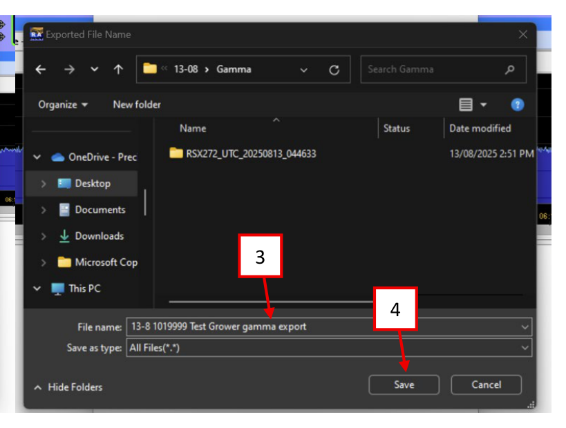
*Save with the date + deal ID + grower name + gamma export naming convention.*

Click **Next** through the remaining wizard pages — SHAPE File Export Options, Virtual
Detector Configuration, Ignore Errors, and Filter Samples — leaving the defaults unless
told otherwise, then **Finish**.

-   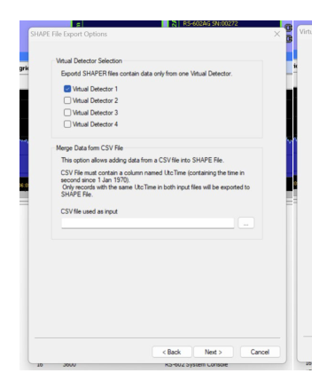
    Virtual Detector Selection — Next.

-   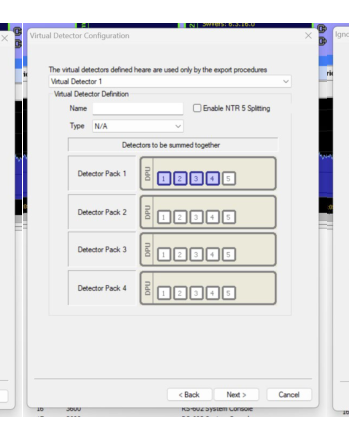
    Virtual Detector Configuration — Next.

-   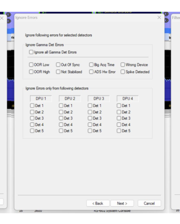
    Ignore Errors — Next.

-   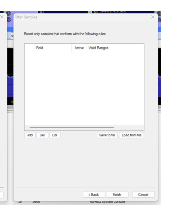
    Filter Samples — Finish.

Wait for the export to complete.

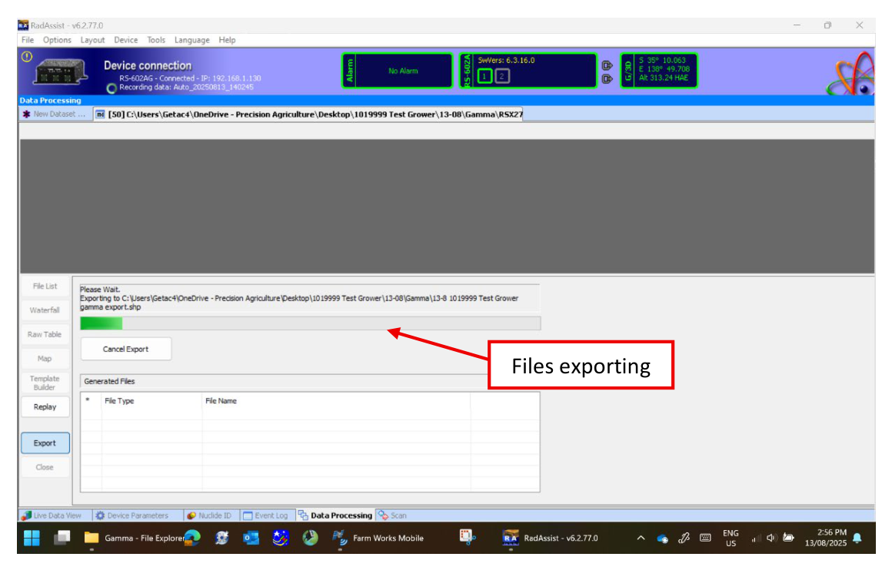
*Files exporting — wait for this to finish before closing RadAssist.*

## 5. Zip the export

Open the working files on the desktop. You'll see four files with the extensions
`.rsvy`, `.dbf`, `.shp` and `.shx`. Highlight the **`.dbf`, `.shp` and `.shx`** files and
compress them to a ZIP named **date + deal ID + grower name + gamma export**.

!!! example
    `13-08 1019999 Test Grower gamma export`

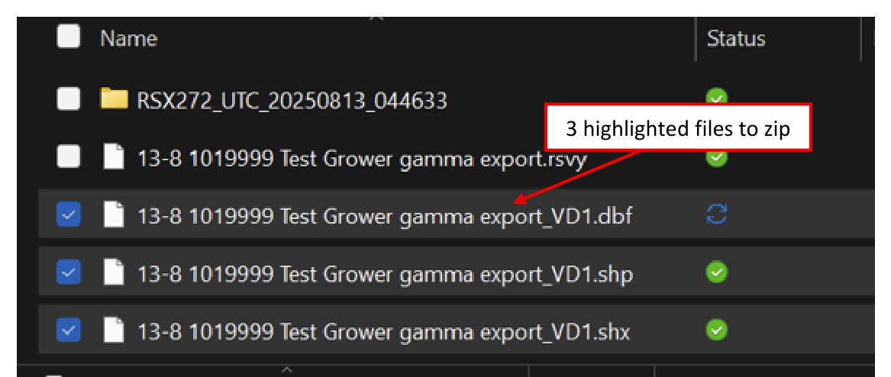
*Select the three files (not the .rsvy) and compress to ZIP.*

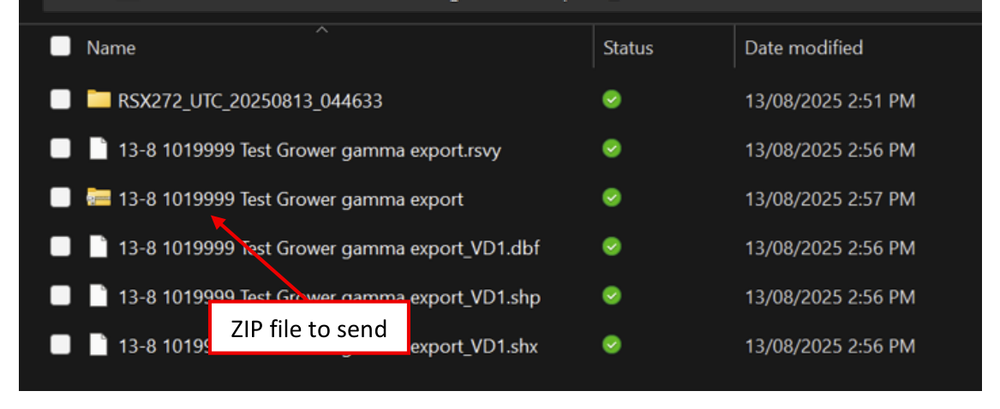
*The ZIP file, named and ready.*

## 6. Email the export

Send the ZIP file to the addresses below, subject line **date + deal ID + grower name +
work type**. Include your EM38 files in the same email if you have them.

| Job location | Send to |
| --- | --- |
| VIC, TAS, SA, WA | `h.birks@pag.earth`, `gis@pag.earth` |
| NSW, QLD, NT | `k.pain@pag.earth`, `gis@pag.earth` |

!!! warning "WARNING"
    Confirm the email actually sent by checking your **Sent Items** folder. If it's not
    sending, try again at your accommodation where you have better LTE signal — don't
    leave the field assuming it went through.

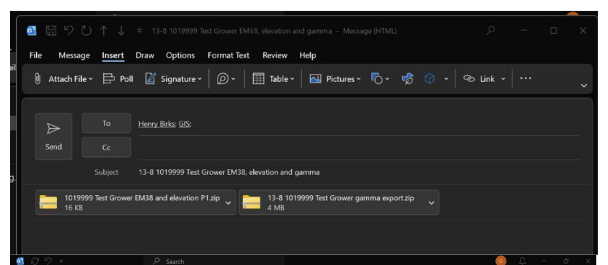
*Confirm the email landed in Sent Items before you leave the field.*

When the job is finished, move the job folder into the **Completed Jobs** folder on the
desktop.

---

Next: [Packup Procedure](05-packup.md). Pack down the rig at the end of the job.
